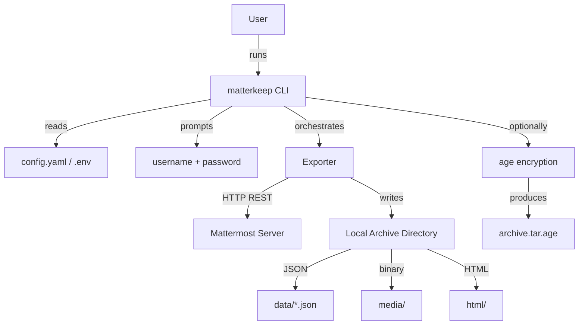
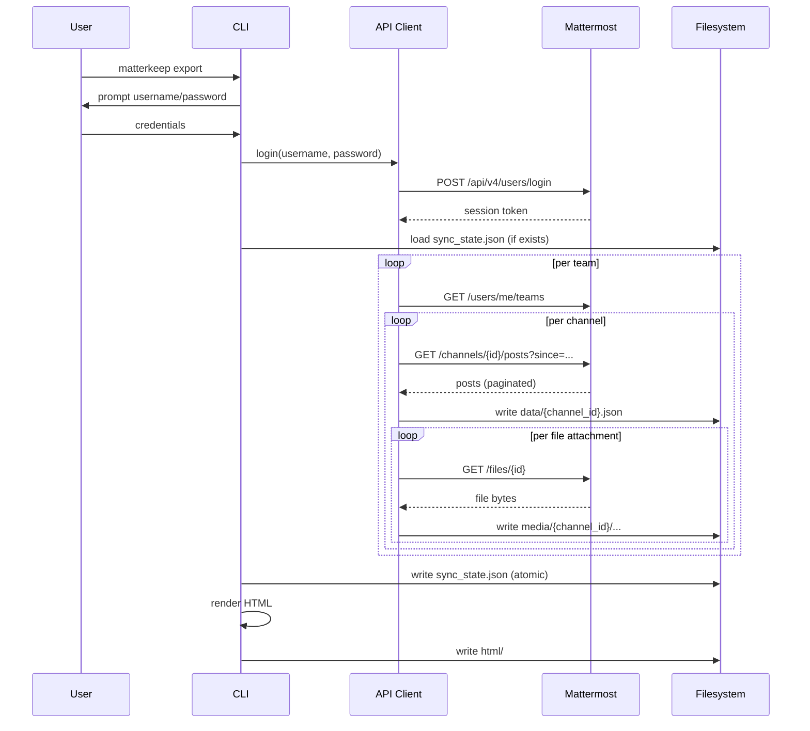

# Design Brief: matterkeep

> **Version:** 0.1.0-draft
> **Date:** 2026-03-27
> **Status:** Draft

---

## 1. Problem Statement

Mattermost workspaces accumulate years of institutional knowledge in channels,
threads, DMs, and file attachments. Users have no built-in way to take that
history offline, search it without a live server, or preserve it when they
leave an organisation. `matterkeep` solves this for any user with a regular
(non-admin) account.

---

## 2. Goals

- Export a user's full accessible message history and media into a
  self-contained directory.
- Archive is viewable in any browser, air-gapped, with no server process.
- Incremental sync: repeated runs only fetch what's new.
- Optional media-only mode: download attachments without message history.
- Optional encryption of the archive with `age`.

---

## 3. Non-Goals (v1)

- Admin/compliance bulk export
- Import into other platforms
- WebSocket live streaming
- GUI / desktop wrapper
- Docker image (deferred post-MVP)

---

## 4. Architecture

### System Context



### Export Sequence



### Components

| Component | File | Responsibility |
|-----------|------|---------------|
| CLI | `cli.py` | Commands, option parsing, top-level error handling |
| Config | `config.py` | Load/validate YAML + env, build Config dataclass |
| Auth | `auth.py` | Login (credentials → session token), PAT fallback |
| API Client | `client.py` | Rate limiting, retry, credential-scrubbing log filter |
| Exporter | `exporter.py` | Pipeline: teams → channels → posts → files → sync state |
| Models | `models.py` | Post, Channel, Team, User, FileAttachment, SyncState |
| Renderer | `renderer.py` | Jinja2 HTML generation, Lunr.js index building |
| Search | `search.py` | CLI grep across JSON exports |
| Encrypt | `encrypt.py` | Shell out to age, produce .tar.age |

---

## 5. Data Model (entities)

- **Team**: id, name, display_name
- **Channel**: id, team_id, name, display_name, type (O/P/D/G), membership (member/left)
- **Post**: id, channel_id, user_id, message, create_at, update_at, root_id, type, files[], reactions[]
- **FileAttachment**: id, name, size, mime_type, local_path
- **Reaction**: emoji_name, user_id, timestamp
- **User**: id, username, display_name, avatar_url
- **SyncState**: version, last_run, channels{channel_id: last_post_timestamp}

---

## 6. Auth Design

### MVP: Username + Password

1. `matterkeep export` prompts for username (or reads from `.env`) and password
   (always prompted via `click.prompt(hide_input=True)` — never stored or logged).
2. `auth.py` posts to `POST /api/v4/users/login`.
3. Session token extracted from `Token` response header.
4. Token held in `Config` object in memory for the duration of the run.
5. A `logging.Filter` subclass scrubs the token from all log records.

### Future: Personal Access Token

- Read from `MM_TOKEN` env var (via `.env`) or system keyring.
- `auth.py` checks for PAT first; falls back to interactive prompt if absent.
- Same scrubbing filter applies.

---

## 7. CLI Interface

```
matterkeep export [OPTIONS]
  --config PATH          Config YAML (default: ./config.yaml)
  --output-dir PATH      Archive root (default: ./archive)
  --full                 Force full re-export
  --channels TEXT        Include only these channels (comma-separated)
  --exclude-channels TEXT
  --include-left         Archive public channels user has left
  --skip-files           Skip attachment downloads
  --media-only           Download media only; skip message history output
  --skip-render          Skip HTML rendering (JSON export only)
  -v / --verbose         Debug logging
  --insecure             Disable TLS verification (prints warning)

matterkeep status [OPTIONS]
  --output-dir PATH

matterkeep encrypt [OPTIONS]
  --output-dir PATH
  --recipient TEXT       age public key (omit for passphrase mode)
  --output PATH          .tar.age output path
  --shred                Overwrite and delete unencrypted archive after encryption

matterkeep search QUERY [OPTIONS]
  --output-dir PATH
  --channel TEXT
  --limit INT            (default: 20)
```

---

## 8. File Layout

```
matterkeep/
├── src/
│   └── matterkeep/
│       ├── __init__.py
│       ├── __main__.py
│       ├── cli.py
│       ├── auth.py
│       ├── client.py
│       ├── config.py
│       ├── exporter.py
│       ├── renderer.py
│       ├── encrypt.py
│       ├── models.py
│       ├── search.py
│       └── templates/
│           ├── base.html
│           ├── index.html
│           ├── channel.html
│           └── assets/
│               ├── style.css
│               └── search.js
├── tests/
│   ├── conftest.py
│   ├── test_auth.py
│   ├── test_client.py
│   ├── test_exporter.py
│   ├── test_renderer.py
│   ├── test_config.py
│   ├── test_encrypt.py
│   └── test_cli.py
├── design/
├── pyproject.toml
├── CLAUDE.md
├── CHANGELOG.md
├── .env.example
├── config.example.yaml
└── .gitignore
```

---

## 9. Security Checklist

- [x] Password via `click.prompt(hide_input=True)` — never in argv, never logged
- [x] Session token scrubbed from all log output via `logging.Filter`
- [x] Server-supplied filenames sanitized (strip `../`, null bytes, length-limit)
- [x] Archive dir created `0o700`; files `0o600`
- [x] Jinja2 autoescaping enforced — all user content escaped
- [x] TLS on by default; `--insecure` prints visible warning
- [x] No credentials in config files (URL and username OK; password never)
- [x] `age` encryption available for archive at rest

---

## 10. Decisions

1. `--media-only` on a fresh run **does** update `sync_state.json` so a
   subsequent full export resumes from the correct timestamp.
2. HTML theme: **dark by default**, with `prefers-color-scheme` support.
3. License: **MIT** confirmed.

---

## 11. Recommended Implementation Order

1. Models + Config
2. Auth (login + PAT stub)
3. API Client (with tests using `responses` mock)
4. Exporter — single channel first, then generalise; sync state
5. CLI — `export` and `status` commands
6. Renderer — minimal Jinja2 template, iterate
7. Search index (Lunr.js integration)
8. Encrypt subcommand
9. CLI `search` subcommand
10. Polish: error messages, progress bars, README
