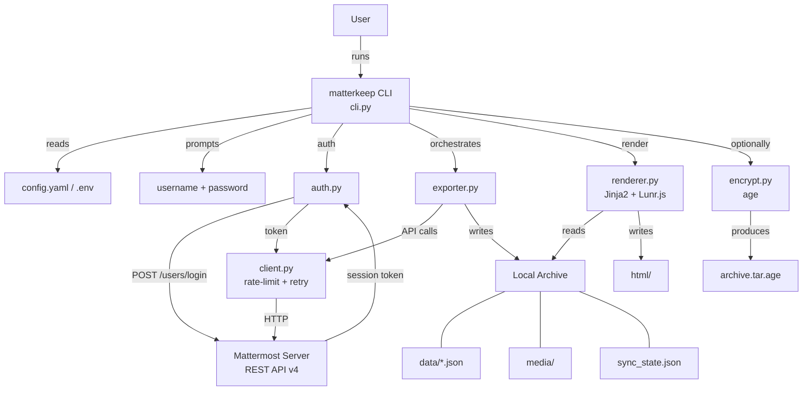

# matterkeep

> **Version:** 0.1.0-draft
> **Date:** 2026-03-27
> **Classification:** Internal
> **Status:** Draft

<!-- PRE-FILLED from design session — review all sections marked [REVIEW] -->

---

## 1. Executive Summary

### 1.1 Intent

Mattermost workspaces accumulate years of institutional knowledge — discussions,
decisions, and files — that users cannot easily take offline or preserve when
they leave an organisation. `matterkeep` gives any regular (non-admin) user a
single CLI command to export their entire accessible message history and media
into a self-contained, browseable, searchable archive that works without a
running server or internet connection.

### 1.2 Target Audience

| Audience | Need | How This Application Serves Them |
|----------|------|----------------------------------|
| Individual Mattermost users | Offline backup of personal message history and files | CLI export to static HTML + JSON |
| Users leaving an org | Preserve history before account access ends | Full or incremental export before offboarding |
| Security-conscious users | Archive without cloud dependency | Runs locally; no third-party services |

### 1.3 Elevator Pitch

matterkeep is a command-line tool that backs up everything you can see in
Mattermost — messages, threads, reactions, and file attachments — into a folder
on your computer. Open the folder in any browser and you have a fully searchable
copy of your history, with no internet connection required. Run it again later
and it only fetches what's new.

---

## 2. Architecture & Design

### 2.1 System Overview

`matterkeep` is a single-user CLI tool written in Python 3.11+. It is installed
via `pip` and run as the command `matterkeep`. There is no server process, no
database, and no cloud dependency. The output is a directory of flat files
(JSON + HTML + binary media) that can be opened directly in a browser.

### 2.2 Architecture Diagram

### 2.3 Core Components

| Component | Responsibility | Technology |
|-----------|---------------|------------|
| `cli.py` | Command parsing, option handling, top-level error reporting | click |
| `config.py` | Load and validate YAML config + env vars; build Config dataclass | pyyaml, python-dotenv |
| `auth.py` | Authenticate via username/password or PAT; return session token | requests (via mattermostdriver) |
| `client.py` | HTTP wrapper: rate limiting, retry with backoff, credential-scrubbing log filter | mattermostdriver, requests |
| `exporter.py` | Pipeline: teams → channels → posts → files; manage sync state | — |
| `models.py` | Dataclasses: Post, Channel, Team, User, FileAttachment, Reaction, SyncState | dataclasses |
| `renderer.py` | Generate static HTML archive and Lunr.js search index from JSON data | jinja2, mistune |
| `search.py` | CLI keyword search across exported JSON (headless use) | — |
| `encrypt.py` | Encrypt archive to age-encrypted tarball; optional shred | subprocess (age CLI) |

### 2.4 Data Flow

#### Inputs

| Input | Source | Format | Validation |
|-------|--------|--------|------------|
| Server URL | config.yaml or MM_URL env | string | URL format check at startup |
| Username | .env (MM_USERNAME) or prompt | string | non-empty |
| Password | interactive prompt only | string | non-empty; never stored |
| Config file | config.yaml | YAML | schema validation on load |
| Sync state | sync_state.json in archive | JSON | version field check |
| Channel filters | CLI flags --channels / --exclude-channels | comma-separated strings | validated against API response |

#### Processing

1. Auth: credentials → session token (held in memory)
2. Discovery: enumerate teams → channels the user belongs to
3. For each channel: load last-seen timestamp from sync state; paginate posts since that timestamp
4. For each post with file_ids: download files (streaming, deduplicated by file_id)
5. Merge edited posts into existing channel JSON by post id
6. Write per-channel JSON atomically
7. Update sync_state.json atomically (temp file + rename)
8. Render HTML from JSON data using Jinja2 templates
9. Build Lunr.js index (Python-side JSON), embed in HTML

#### Outputs

| Output | Destination | Format | Purpose |
|--------|-------------|--------|---------|
| Channel data | `data/{channel_id}.json` | JSON | Machine-readable message history |
| User profiles | `users.json` | JSON | Username/display name lookup |
| Media files | `media/{channel_id}/{file_id}_{name}` | binary | Attached files and images |
| HTML archive | `html/` | HTML/CSS/JS | Browser-viewable archive |
| Sync state | `sync_state.json` | JSON | Incremental sync checkpoint |
| Encrypted bundle | `*.tar.age` | binary | Optional encrypted archive |

### 2.5 State Management

The tool is stateless between runs except for `sync_state.json`, which stores
the last-seen post timestamp per channel. The session token is held only in
the `Config` object in memory and discarded when the process exits. No database,
no daemon, no persistent connections.

`sync_state.json` is written atomically (write to temp file in same directory,
then `os.replace()`) to prevent corruption on interrupted runs.

### 2.6 API / Interface Contracts

matterkeep consumes the Mattermost REST API v4. It does not expose any API.
See `design/api-spec.yaml` for the full consumption surface.

Auth: `POST /api/v4/users/login` → `Token` response header (session token).
All subsequent requests: `Authorization: Bearer <token>`.

---

## 3. Security Considerations

### 3.1 Threat Model

#### Assets

| Asset | Sensitivity | Impact if Compromised |
|-------|------------|----------------------|
| Mattermost password | Critical | Full account takeover |
| Session token | High | Full API access for token lifetime |
| Archive contents | Medium–High | Exposure of private messages and files |
| Attachment filenames (server-supplied) | Low | Path traversal if unsanitized |

#### Threat Actors

- Malicious Mattermost server (adversarial filename in file metadata)
- Local user reading another user's archive directory
- Log aggregation system capturing credentials from debug output

#### Attack Surface

- Interactive credential prompt (password)
- Config file (server URL, username — not password)
- `.env` file (server URL, username — not password)
- HTTP traffic to Mattermost server
- Archive directory on local filesystem
- HTML archive if served over HTTP (stored XSS vector)

### 3.2 Security Controls

| Control | Threat Mitigated | Implementation |
|---------|-----------------|----------------|
| Password via `click.prompt(hide_input=True)` | Password in process list / logs | Never in sys.argv; not echoed |
| Credential-scrubbing log filter | Token/password in log output | `logging.Filter` subclass replaces token value in all log records |
| Session token in memory only | Token persisted to disk | Not written to any file; discarded on exit |
| Filename sanitization | Path traversal (../../etc/passwd) | Strip path separators, null bytes; enforce max length before writing |
| Archive dir `0o700`, files `0o600` | Unauthorized local read | Set explicitly; umask set at startup |
| Jinja2 autoescaping | Stored XSS in HTML archive | `Environment(autoescape=True)`; no `| safe` on user content |
| TLS on by default | MITM on API traffic | `verify=True` default; `--insecure` prints visible stderr warning |
| No credentials in config file | Credential exposure via committed config | Password path not present in config schema; enforced in `config.py` |

### 3.3 Compliance Relevance

| Framework | Applicability | Notes |
|-----------|--------------|-------|
| GDPR | Indirect | Archive contains personal data; user is the data subject and controller for their own archive |
| SOC 2 | N/A | Not a SaaS service |

### 3.4 Secure Development Practices

- Dependency pinning with hashes in `pyproject.toml`
- `pip-audit` in CI for vulnerability scanning
- `ruff` (linter) + `mypy --strict` (type checker) in CI
- `responses` library for HTTP mocking in tests (no real credentials in test suite)
- No secrets in source code or test fixtures

---

## 4. Dependencies & Third-Party Components

### 4.1 Runtime Dependencies

| Dependency | Version | License | Purpose | Source |
|-----------|---------|---------|---------|--------|
| mattermostdriver | >=7.3.2 | MIT | Mattermost API v4 client | PyPI |
| click | >=8.1 | BSD-3 | CLI framework | PyPI |
| pyyaml | >=6.0 | MIT | Config file parsing | PyPI |
| python-dotenv | >=1.0 | BSD-3 | .env file loading | PyPI |
| jinja2 | >=3.1 | BSD-3 | HTML template rendering | PyPI |
| mistune | >=3.0 | BSD-3 | Markdown to HTML | PyPI |
| keyring | >=25.0 | MIT | System keyring (future PAT storage) | PyPI |
| rich | >=13.0 | MIT | Progress bars, styled output | PyPI |

### 4.2 Development Dependencies

| Dependency | Version | License | Purpose |
|-----------|---------|---------|---------|
| pytest | >=8.0 | MIT | Test runner |
| pytest-cov | >=5.0 | MIT | Coverage reporting |
| pytest-mock | >=3.14 | MIT | Mock helpers |
| responses | >=0.25 | Apache-2.0 | HTTP request mocking |
| ruff | >=0.5 | MIT | Linter + formatter |
| mypy | >=1.10 | MIT | Static type checker |
| pip-audit | >=2.7 | Apache-2.0 | Dependency vulnerability scanning |

### 4.3 External Services & APIs

| Service | Provider | Purpose | Data Exchanged | Fallback Strategy |
|---------|----------|---------|---------------|-------------------|
| Mattermost REST API v4 | User's Mattermost server | Message and file data source | Credentials (auth only), read-only message/file data | N/A — tool requires server access |

### 4.4 License Compatibility

<!-- [REVIEW] All runtime dependencies are MIT or BSD-3, both permissive and
compatible with MIT for the project itself. responses is Apache-2.0 (dev-only).
No copyleft dependencies identified. -->

All runtime dependencies carry MIT or BSD-3 licenses, which are compatible with
MIT distribution. `responses` (Apache-2.0) is a dev dependency only and does not
affect the distributed package license.

---

## 5. Deployment Model

### 5.1 Deployment Architecture

Local CLI tool. User installs via `pip install matterkeep` (or `pip install -e .`
from source). Runs on the user's machine. No server, no cloud, no shared
infrastructure.

### 5.2 Infrastructure Requirements

| Resource | Specification | Purpose |
|----------|--------------|---------|
| Python | 3.11+ | Runtime |
| Disk | Varies (proportional to archive size) | Archive storage |
| Network | Access to Mattermost server | API calls during export |
| `age` CLI | Any recent version | Optional archive encryption |

### 5.3 Environments

| Environment | Purpose | Access Control |
|-------------|---------|---------------|
| Development | Local dev and testing | Developer only |
| Production | User's local machine | User only |

No staging environment — this is a local tool with no shared infrastructure.

### 5.4 CI/CD & Release Process

<!-- [REVIEW] Define CI provider -->

- CI: TBD (GitHub Actions recommended)
- Pipeline: `ruff check` → `mypy` → `pytest --cov` → `pip-audit`
- Release: `pyproject.toml` version bump → CHANGELOG update → git tag → PyPI publish (optional)
- `/release` skill handles version bump and changelog

### 5.5 Operational Considerations

No operational commitments — this is a local tool. Users are responsible for
their own archive storage and backups.

---

## 6. Licensing

### 6.1 Software License

**License:** MIT

**Rationale:** Permissive open source; aligns with the personal-use nature of
the tool and all dependency licenses.

### 6.2 Licensing / Subscription Model

**Model Type:** Open Source — Free Use

- **License:** MIT
- **Support:** Community only

---

## 7. Revenue Model

### 7.1 Revenue Strategy

**Primary Model:** Internal Tool / Personal Use

No direct revenue. This is a personal utility tool.

---

## 8. Intellectual Property

### 8.1 Novelty Statement

No patent claims anticipated. `matterkeep` is a practical integration of
existing open-source components applied to the specific use case of
user-scoped Mattermost archiving.

### 8.2 Differentiators

| Differentiator | Existing Approach | Our Approach | Advantage |
|---------------|-------------------|--------------|-----------|
| User-scoped only | Most tools require admin/compliance export | User-PAT or credential auth only | Works for any user, no admin required |
| Static HTML output | Most exporters produce JSON/CSV only | Fully rendered, searchable HTML archive | Browseable without tooling |
| Incremental sync | Most tools do full exports | Per-channel timestamp tracking | Fast repeated runs |

### 8.3 Prior Art

| Reference | Type | Relevance | How We Differ |
|-----------|------|-----------|---------------|
| Mattermost bulk export (admin) | Product feature | Requires admin; compliance-focused | User-scoped; personal use |
| mattermost-log-viewer | Product | Read-only viewer for admin exports | Self-contained export + viewer |

---

## Appendices

### A. Glossary

| Term | Definition |
|------|-----------|
| PAT | Personal Access Token — a long-lived API token generated by a Mattermost user |
| Session token | Short-lived token returned by /users/login; held in memory only |
| Incremental sync | Export run that fetches only posts newer than the last recorded timestamp |
| age | A simple, modern file encryption tool (filippo.io/age) |
| Lunr.js | Client-side full-text search library for JavaScript |

### B. Document History

| Version | Date | Author | Changes |
|---------|------|--------|---------|
| 0.1.0-draft | 2026-03-27 | design session | Initial draft |

### C. References

| Document | Location | Purpose |
|----------|----------|---------|
| API consumption spec | design/api-spec.yaml | Mattermost endpoints used |
| Design brief | design/design-brief.md | Architecture diagrams and component detail |
| Handoff document | handoff-mm-archive.md | Original project specification |
